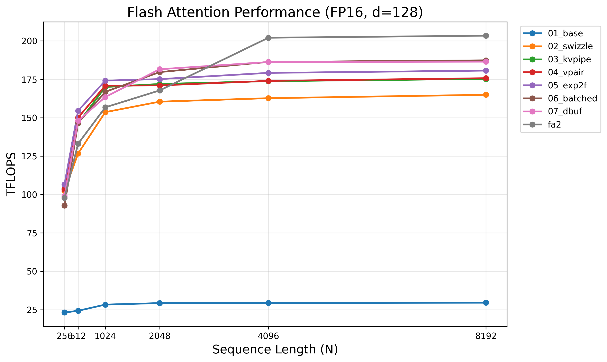

# Flash Attention From Scratch

A step-by-step implementation of flash attention using NVIDIA Tensor Cores and inline PTX `mma.sync.aligned.m16n8k16`. Starting from a naive tiled kernel, each optimization is isolated in its own file and benchmarked against the previous.

Built on the same infrastructure as [cuda-hgemm-mma](https://github.com/yencal/cuda-hgemm-mma): hand-rolled swizzle, `ldmatrix` fragment loads, and register-level control over the GEMM inner loops.

## Requirements

- CUDA Toolkit (tested with 12.x)
- GPU with SM 80+ (Ampere or later)
- Python 3 + matplotlib (for plotting)

## Build & Run

```bash
make                           # build main benchmark
./flash_attention              # correctness check + benchmark all kernels
python3 scripts/plot_results.py flash_attention_results.csv
```

For NCU profiling of individual kernels:

```bash
make profile
./profile 6                    # single-kernel launch for NCU
```

## Config

FP16 I/O, FP32 accumulators, forward pass only, non-causal, d_head=128, batch=16, heads=16. All GEMMs use `mma.sync.aligned.m16n8k16.row.col.f32.f16.f16.f32`. Targets SM 80 (A100) with `-O3 --use_fast_math`.

## Kernel Progression

| Kernel | Description | Tile |
|--------|-------------|------|
| 01_base | Naive tiled flash attention, no swizzle, synchronous K/V loads | 64×32, 2 warps |
| 02_swizzle | + XOR swizzle for bank-conflict-free SMEM + larger tile | 64×128, 4 warps |
| 03_kvpipe | + `cp.async` KV pipelining (V overlaps QK, K[j+1] overlaps PV) | 64×128, 4 warps |
| 04_vpair | + `ldmatrix.x4.trans` for paired V fragment loads | 64×128, 4 warps |
| 05_exp2f | + Fused `exp2f` softmax (log2 space, 2 instructions instead of 4) | 64×128, 4 warps |
| 06_batched | + Batched M-tiles with K/V fragment reuse, V preloaded into registers | 128×64, 4 warps |
| 07_dbuf | + Double-buffered `ldmatrix` in GEMM inner loops (regression) | 128×64, 4 warps |

## Source Layout

Each kernel is a single header (`XX_name.cuh`) containing the `__global__` function and a `Run()` wrapper struct. Shared infrastructure:

| File | Role |
|------|------|
| `fragment.cuh` | Register fragment types for MMA operands (A, B, C) |
| `mma_ops.cuh` | Inline PTX wrapper for `mma.sync.aligned.m16n8k16` |
| `load_ldmatrix.cuh` | `ldmatrix` load functions: plain, swizzled, transposed pairs |
| `gemm.cuh` | Tiled GEMM building blocks for QK and PV phases |
| `online_softmax.cuh` | Online softmax with running max/sum correction |
| `epilogue.cuh` | O normalization (divide by l) and writeback to GMEM |
| `kernel_helpers.cuh` | `cp.async` tile loaders, swizzle helpers |

## Results

**NVIDIA A100-SXM4 (80 GB)**

The best kernel (06_batched) achieves **92% of FlashAttention-2** (187 vs 204 TFLOPS at N=8192).



| Kernel | N=1024 | N=4096 | N=8192 | % FA2 (N=8192) |
|--------|--------|--------|--------|----------------|
| FA2 | 157.7 | 202.1 | 203.7 | 100% |
| 01_base | 28.3 | 29.4 | 29.5 | 14% |
| 02_swizzle | 153.6 | 162.6 | 165.0 | 81% |
| 03_kvpipe | 170.0 | 173.4 | 175.1 | 86% |
| 04_vpair | 170.8 | 174.6 | 175.7 | 86% |
| 05_exp2f | 174.2 | 178.8 | 181.1 | 89% |
| 06_batched | 166.1 | 186.0 | 187.3 | 92% |
| 07_dbuf | 165.1 | 185.5 | 186.4 | 92% |

## Blog Post

For a detailed walkthrough of the optimization techniques, see the accompanying blog post: TODO
